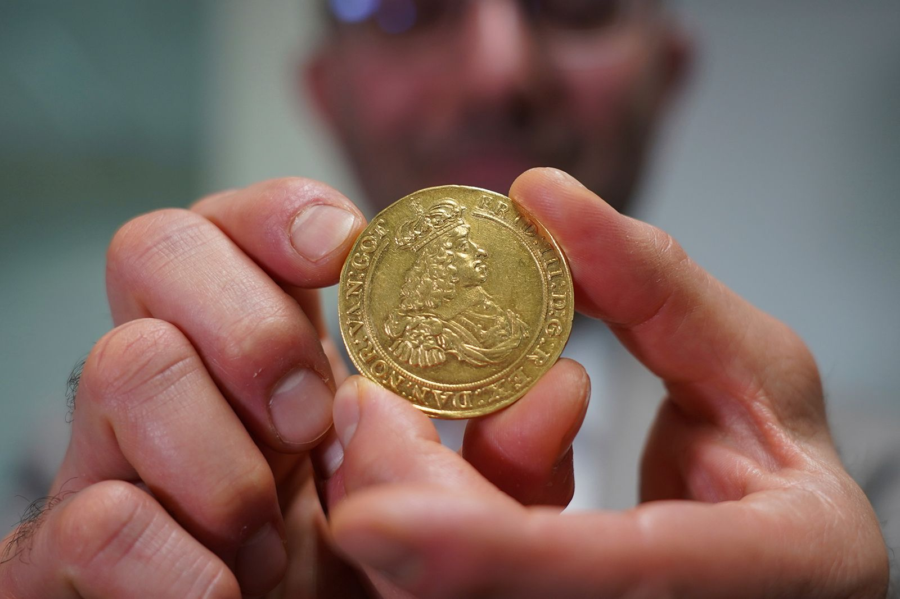

<p float="left">
  
  
</p>

# Gaji's Coin Toss Game

Welcome to **Gaji's Coin Toss Game**, an exciting Python-based game where you and Stark compete over 5 thrilling rounds to see who emerges as the ultimate coin toss champion!

## Features
- Interactive gameplay.
- Randomized coin toss outcomes.
- Tracks scores for both the player and Stark.
- Friendly and competitive banter with Stark.

## How to Play
1. **Start playing [here](https://tinyurl.com/Gaji-Coin-toss-game)**
2. Choose either **Heads** or **Tails** at the beginning of each round.
3. Decide whether you'd like to flip the coin.
4. If the coin lands on your choice, you score a point. If it lands on Stark's choice, Stark scores a point.
5. The game ends after 5 rounds, and the final score determines the winner.
6. If you want to stop early, you can choose "no" when asked if you'd like to flip the coin.

## Requirements
- Python 3.x
- `random` library (pre-installed in Python)

## Installation
1. Clone this repository or download the script.
2. Run the game in any Python environment (e.g., VSCode, Jupyter Notebook, or Google Colab).

## Sample Output
```
Welcome to Gaji's Coin Toss Game :)
You and Stark get to go on 5 exciting rounds to see who wins!

What do you choose? (Heads/Tails): heads
Stark: I choose tails.

Would you like to flip the coin? (yes/no): yes
Flipping...
The coin landed on Heads.
You win this round!

Current Score: Stark: 0, You: 1
```

## Contributing
Feel free to fork this repository, make improvements, and submit a pull request. Contributions are always welcome!

